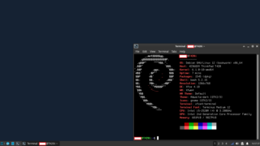

+++
date = '2024-03-03T17:58:00Z'
lastmod = '2024-03-03T17:58:00Z'
draft = false
title = 'Debian 12 and Old ThinkPads'
description = 'Back to Debian on desktop, after sleeping on it for many years.'
tags = ['tech']
+++

Distrohopping can be a very difficult habit to break. In my case, I've [realised quite early on]() that there aren't too many real differences between Linux distros and sticking to a few mainline ones (depending on use case) is enough.

Like many others, I consider the ThinkPad T series, especially the T420, to be just about the perfect laptop in terms of hardware design and Linux support. The T420 is now 13 years old and is therefore in many ways obsolete, but thanks to the fact that it has (2nd gen) Intel Core series CPU and offers easy upgradability, it still manages to hold up as a usable laptop for less demanding tasks.

When I first got my T420 in 2015, getting Debian fully up and running required adding nonfree repos to get wifi working & potentially having to sideload the drivers during installation if ethernet wasn't available. I also remember UEFI boot not being an option (which in fairness was an issue on every distro/kernel version I've tried at the time).

Once the OS was installed, I remember the Iceweasel browser being my first real exposure to trademark & licensing disputes within Linux and the broader Free Software community. Despite having sporadically used Ubuntu and Arch Linux for several years already, as someone getting into Linux to learn new operating systems, I didn't yet understand what a "GNU" was or appreciate what "free" software fully entailed - Instead, I started looking for ways of getting the more up to date Mozilla Firefox release installed. This meant carrying out what at the time felt like hacky workarounds which alongside Debian's older packages (even in the unstable repos) convinced me to go back to Xubuntu.

For many years after that, I've mostly used Debian on various servers and Raspberry Pi models, not really considering it for desktop use.

With the release of Debian 12, I decided to give it another try on my T420i as I wanted a spare computer which can run a stable Linux installation that doesn't require frequent updating or too much maintenance.

Modern versions of Linux work perfectly with old ThinkPads' early UEFI implementation so this time I was able to set it to UEFI-only boot mode. The installer recognised my WLAN card and I was able to carry out an installation on wifi with LVM + LUKS for encryption.

With a laptop of this age which isn't running any demanding software on the Intel integrated graphics chip, I don't see a particular benefit to using Wayland. Therefore I went with Xfce as the desktop environment; This has always been my favourite DE alongside the more demanding KDE Plasma.

Minimal additional setup was required on top of the default Xfce installation:

- vim, which surprisingly wasn't installed by default.
- Font packages - Noto, Terminus.
- gnome-system-tools for a more comprehensive set of graphical settings.
- gvfs for accessing network fileshares in Thunar.
- rsync.
- gutenprint for drivers for my Brother printer; CUPS was already installed.

I was happy to find that all the packages I needed for this setup were readily available in the default repos or could be just as easily installed via .deb packages. With how much more mature desktop Linux feels these days and the fact that Debian 12 is still relatively new, nothing feels as outdated as some make it out to be.

If you require the very latest software or have an Nvidia GPU, I'd still recommend going with something more bleeding edge (Arch), but for a somewhat obsolete laptop such as an old ThinkPad, Debian is definitely one of the best choices. Definitely a lot less hassle than a distro like Ubuntu, where you have to go out your way to remove the Snap package manager, only to then struggle to find the software you require in the repos.

If you have an old computer which you simply want a "Just Works" distro on, Debian 12 would definitely be my recommendation.