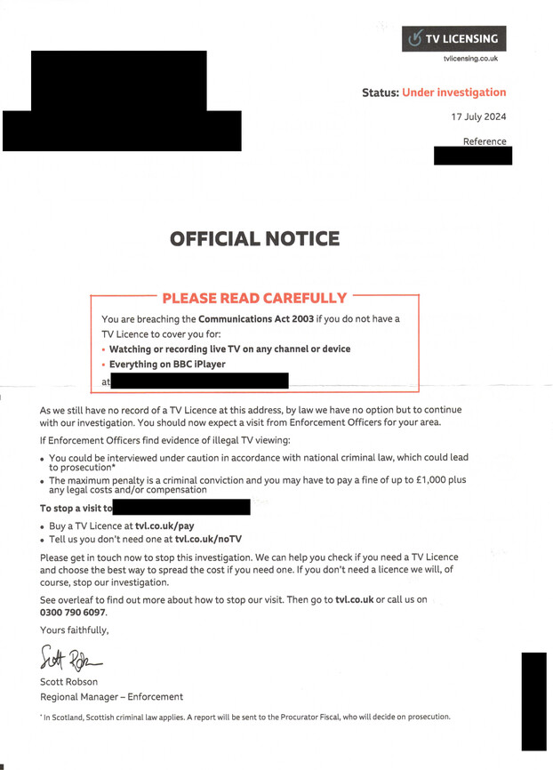
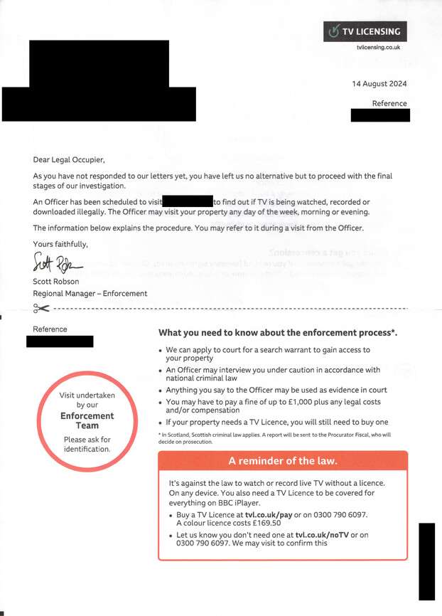
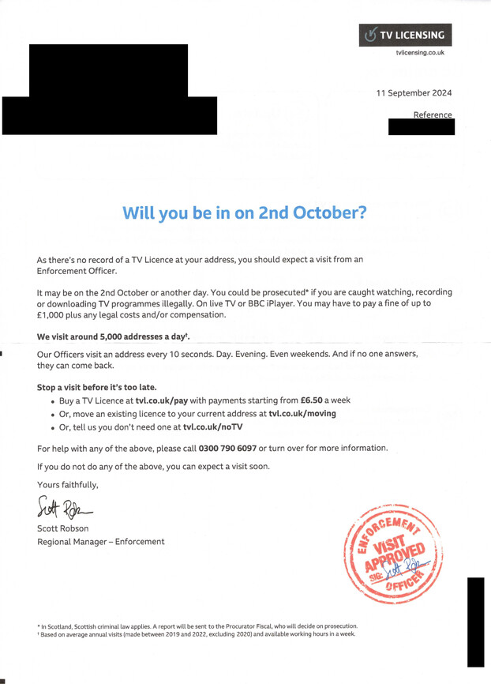
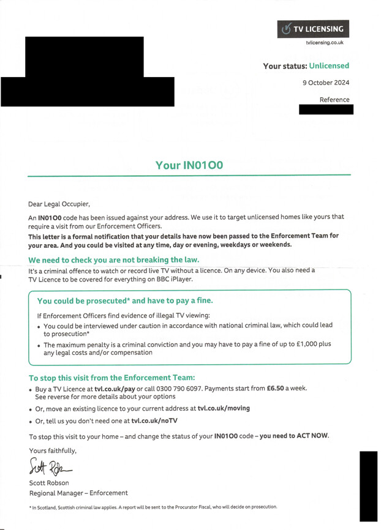
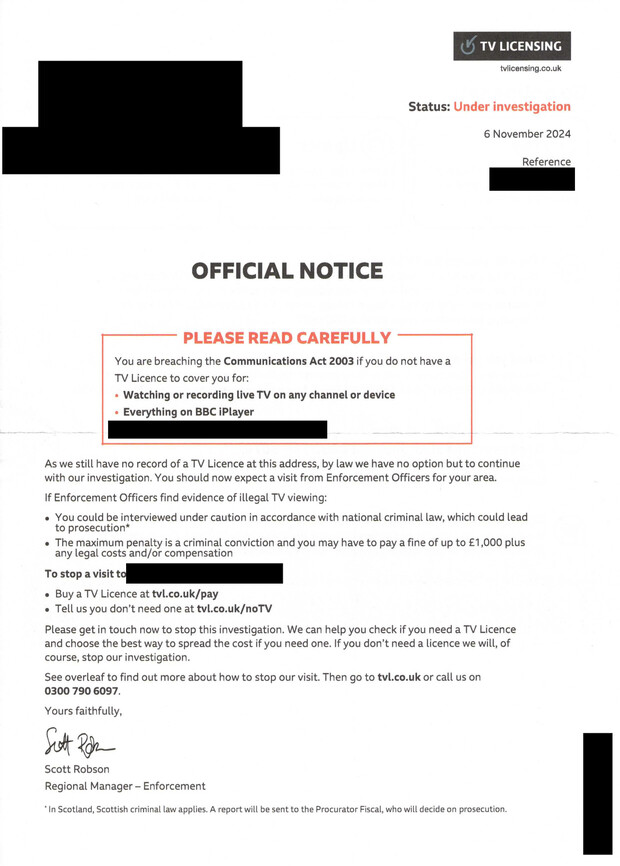
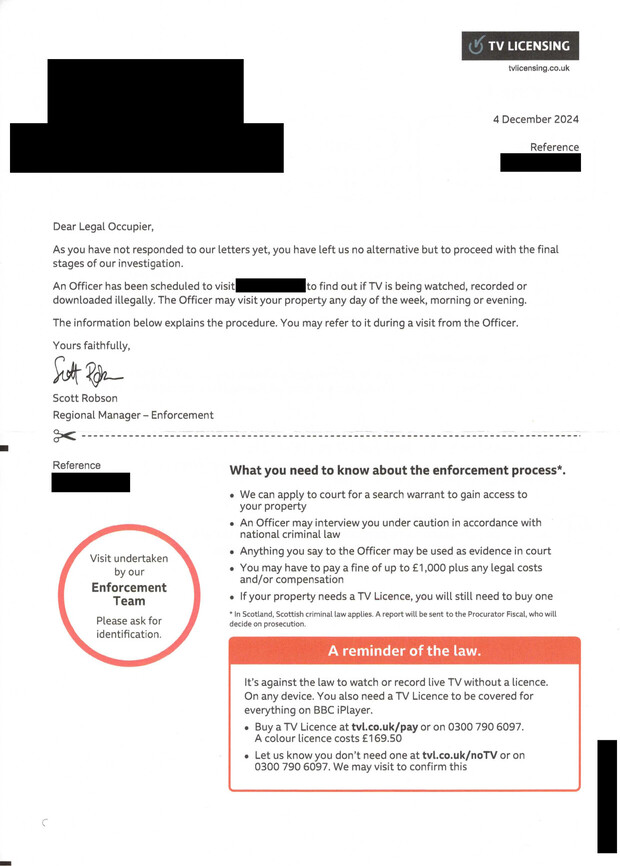
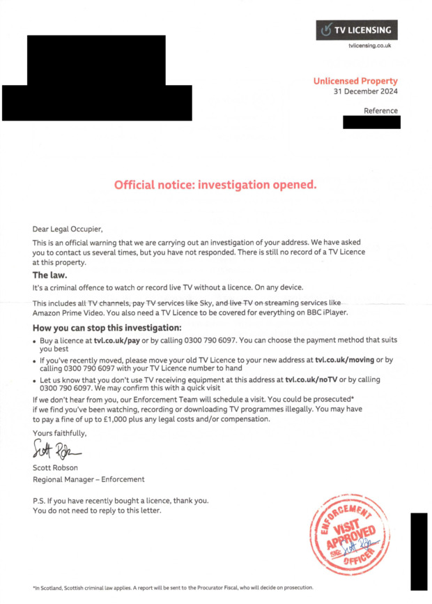

+++
date = '2024-12-26T13:09:50Z'
lastmod = '2025-01-11T15:01:33Z'
draft = false
title = 'TV License Letters'
description = 'My collection of TV License letters.'
weight = 6
+++

Since moving into my currently property in July 2024, I've been receving monthly TV Licensing letters threatning me with "enforcement officer" visits and penalties for breaking the Communications Act of 2003.

I do not receive live TV broadcasts or watch BBC iPlayer and therefore don't require a TV License in line with this law. I don't feel that a company who's services I don't use should have any of my details nor should I need to inform them that I'm not interested.

If you're a UK resident who doesn't watch live TV broadcasts or log into BBC iPlayer, you're also under no obligation to pay for a TV license or acknowledge these letters. **This is not legal advice, I'm not qualified to offer legal advice, do your own research.**

I'll be archiving all letters I receive here for entertainment & educational purposes.

Credit to [http://www.bbctvlicence.com/](http://www.bbctvlicence.com/) for the concept. The site has not been updated since 2022.

Total Attempted Enforcement Officer Visits: **0**

## 2024

### July 2024

First letter I received, it was already waiting for me on my doorstep when I moved in. Addressed to the Legal Occupier as TV Licensing do not have my personal details on record.

### August 2024

After ignoring the first letter, the investigation is now in its final stages with an enforcement officer reportedly being scheduled to knock on my door. This did not happen in August. 

### September 2024

I've now been given a date for the visit, making it easier to ignore a possible knock on my door that day - UK TV Licensing officers have no legal right of entry onto your property without a court-issued search warrant, which they could only obtain with some evidence of live TV being received without a license. 

Note that the letter states the visit may take place on 2nd October "or another day".

No visit took place any day of October either.

### October 2024

A mystery code has been issued against my address.

This apparently means that my details have been forwarded to a local enforcement team (they still don't even have my name, so not sure what details those could be).

This is followed by a menacing warning that I could be visited any time, day or night. This hasn't happened. 

### November 2024

They're continuing the investigation.

### December 2024

A repeat of the August letter this time.

## 2025

### January 2025
